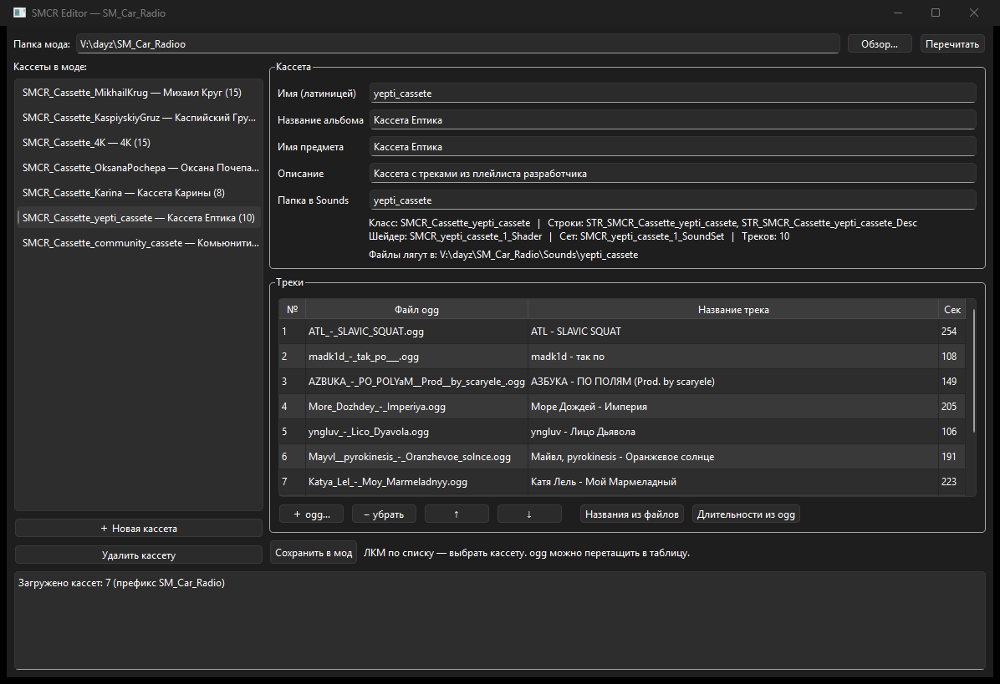

# SMCR Editor

Настольная программа для музыкальных кассет в моде DayZ **SM_Car_Radio**. Мод описывает каждую кассету в `config.cpp` - блок шейдеров, блок сетов, класс предмета, плюс две строки в stringtable. Вручную это правится долго и однообразно, редактор делает то же самое: даёшь имя кассеты и кидаешь ogg-файлы в окно, дальше всё пишется само. Перед записью рядом кладутся бэкапы `.bak`, так что ничего не потеряется.



## Что умеет

**Создание и удаление кассет.** При сохранении правится `config.cpp` и `stringtable.csv`, звук копируется в `Sounds\`, бэкапы рядом.

**Длительность и названия.** Длительность треков читается из ogg сама, названия подставляются из имён файлов - руками ничего не вбиваешь.

**Перетаскивание.** ogg и mp3 просто перетаскиваются в окно мышью.

**Конвертация.** mp3 превращается в ogg прямо в программе - ни ffmpeg, ни других внешних конвертеров не нужно.

**Латиница.** Имена файлов при сохранении переводятся на латиницу. Пути с кириллицей внутри PBO движок DayZ не открывает, трек в игре будет просто без звука. Названия треков и альбома остаются русскими, они лежат в конфиге и на имена файлов не влияют.

## Как работает

1. Указать папку распакованного мода - ту, где лежит `config.cpp`.
2. "+ Новая кассета": имя (латиницей), альбом, название предмета, описание, папка в `Sounds`.
3. "+ ogg..." - выбрать файлы, или просто перетащить их в окно.
4. "Сохранить в мод".

Дальше мод собирается в PBO как обычно. Скрипты мода править не нужно - реестр кассет строится из конфига. Спавн предметов (`types.xml`) редактор не трогает: если кассета должна выпадать как предмет, пропишите её в экономике отдельно.

## Запуск

Программа portable, один exe, рядом ничего класть не нужно:

```
smcr_editor.exe
smcr_editor.exe --root="D:\path\to\SM_Car_Radio"
```

Последнюю открытую папку помнит, поэтому обычно просто запускаешь.

## Сборка

Нужны Qt 6 (Widgets) и CMake:

```bat
cmake -S . -B build -DCMAKE_BUILD_TYPE=Release -DCMAKE_PREFIX_PATH=C:\Qt\6.9.1\mingw_64
cmake --build build
```

Под MinGW после сборки положить рядом плагины Qt (`windeployqt` по exe). Линкуется с `-static-libgcc -static-libstdc++`.

Внутри просто: `modfile` - разбор и запись `config.cpp`/`stringtable.csv` и копирование ogg, `mainwindow` - интерфейс, `ogg` - чтение длительности из ogg-страниц, `convert` - конвертация mp3 в ogg, `thirdparty` - minimp3, libogg, libvorbis (собраны в проект статикой, у них свои лицензии).

## Лицензия

Public domain (The Unlicense): делай что хочешь - юзай, меняй, раздавай, без указаний авторства. У библиотек в `thirdparty/` свои лицензии.

Разработал 0xdead.moscow.
